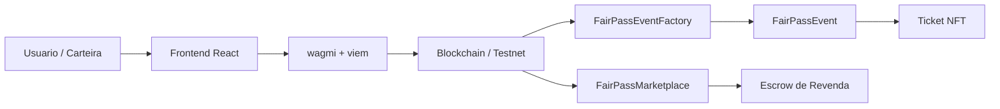

# FairPass Litepaper

## Resumo Executivo

FairPass e uma infraestrutura on-chain para emissao, revenda e reembolso de ingressos digitais. O projeto transforma cada ingresso em um NFT ERC721, fazendo com que o direito de acesso ao evento e o direito ao reembolso acompanhem a propriedade do token.

O objetivo e reduzir dependencia de intermediarios, revendas informais, disputas em cancelamentos e processos manuais de validacao. Com smart contracts, o FairPass automatiza regras de negocio como compra, limite por carteira, custodia em marketplace, transferencia do ingresso, pagamento ao vendedor e reembolso ao dono atual do ticket.

O MVP foi construido com Solidity, Hardhat, OpenZeppelin, React, Vite, wagmi e viem. O fluxo demonstravel cobre criacao de evento, compra de ingresso, revenda via marketplace, cancelamento e refund automatizado.

## 1. Contexto

O mercado de eventos digitais e presenciais depende de plataformas centralizadas para controlar ingressos, repasses e reembolsos. Embora essas plataformas facilitem a distribuicao inicial, ainda existem problemas relevantes quando o ingresso muda de dono ou quando o evento e cancelado.

Em muitos casos, a revenda acontece fora da plataforma oficial. Isso cria risco para compradores, reduz a visibilidade do organizador e dificulta a definicao de quem deve receber um eventual reembolso. Quando o fluxo depende de comprovantes manuais, suporte humano ou acordos informais, surgem atrasos, fraudes e disputas.

FairPass propoe um modelo em que a propriedade do ingresso e verificavel on-chain e as regras principais sao executadas automaticamente por smart contracts.

## 2. Problema

Os principais problemas atacados pelo FairPass sao:

- falta de garantia em revendas informais;
- dificuldade para provar quem e o dono atual do ingresso;
- disputas sobre quem deve receber reembolso apos cancelamento;
- dependencia de intermediarios para validar transferencias;
- pouca transparencia sobre regras de repasse e custodia;
- risco de ingresso duplicado, falso ou negociado fora do controle do organizador;
- processos manuais para pagamento, devolucao e auditoria.

Essas dores afetam organizadores, compradores, vendedores secundarios e plataformas de ticketing.

## 3. Solucao

FairPass emite cada ingresso como um NFT ERC721. O NFT representa:

- direito de acesso ao evento;
- prova verificavel de propriedade;
- direito ao reembolso em caso de cancelamento;
- ativo transferivel dentro de regras controladas pelo contrato.

O FairPass combina regras anti-scalping com mecanismos de escrow. Na venda primaria, o contrato limita a compra a 1 ingresso por carteira. Na revenda, o marketplace atua como escrow: quando um usuario lista um ticket, o NFT e transferido para o contrato do marketplace. Quando outro usuario compra, o contrato transfere o NFT ao comprador e envia o pagamento ao vendedor.

Se o evento for cancelado, o contrato do evento permite que o dono atual do NFT solicite reembolso. O NFT e queimado e o valor do ingresso e enviado para a carteira que possui o ticket no momento do refund.

## 4. Proposta De Valor

Para compradores:

- maior seguranca na compra e revenda;
- propriedade verificavel do ingresso;
- protecao contra revendas sem custodia do NFT;
- direito ao reembolso atrelado ao NFT;
- menos dependencia de suporte manual.

Para organizadores:

- emissao de ingressos com regras transparentes;
- regras anti-scalping no contrato;
- rastreabilidade de venda e revenda;
- controle de status do evento;
- saque de fundos apos conclusao;
- reducao de disputas sobre reembolso.

Para o ecossistema:

- mercado secundario mais confiavel;
- regras de negocio programaveis;
- registro auditavel de transacoes;
- menor dependencia de intermediarios centralizados.

## 5. Arquitetura



O sistema e dividido em tres contratos principais:

1. `FairPassEventFactory`
2. `FairPassEvent`
3. `FairPassMarketplace`

O frontend consome os contratos usando wagmi e viem. As ABIs sao geradas a partir dos contratos Solidity.

## 6. Contratos Inteligentes

### 6.1 FairPassEventFactory

Responsavel por criar novos eventos.

Funcoes principais:

- cria contratos `FairPassEvent`;
- registra eventos criados;
- armazena eventos por organizador;
- recebe taxas de plataforma;
- permite saque das taxas acumuladas.

Esse contrato permite que qualquer organizador crie um novo evento sem depender de deploy manual.

### 6.2 FairPassEvent

Contrato ERC721 de um evento especifico.

Responsabilidades:

- emitir ingressos NFT;
- armazenar preco do ingresso;
- controlar quantidade maxima;
- limitar 1 ingresso por carteira;
- controlar status do evento;
- permitir cancelamento;
- permitir conclusao;
- permitir saque de fundos;
- permitir refund para o dono atual do NFT;
- bloquear transferencias diretas fora do marketplace.

Estados do evento:

```txt
Active
Completed
Canceled
```

### 6.3 FairPassMarketplace

Contrato de revenda com escrow.

Responsabilidades:

- listar tickets;
- receber NFT em custodia;
- permitir compra por outra conta;
- transferir NFT ao comprador;
- transferir ETH ao vendedor;
- permitir cancelamento de listagem pelo vendedor.

## 7. Fluxos On-Chain

### 7.1 Criacao De Evento

1. Organizador preenche os dados no frontend.
2. Frontend chama `createEvent`.
3. Factory cria um novo contrato `FairPassEvent`.
4. Evento e registrado on-chain.
5. Compradores podem acessar o evento e comprar ingressos.

### 7.2 Compra De Ingresso

1. Usuario acessa a pagina do evento.
2. Usuario chama `mintTicket` enviando o valor exato.
3. Contrato valida status, prazo, supply e limite por carteira.
4. Contrato emite NFT para o comprador.
5. O NFT passa a representar o ticket.

### 7.3 Revenda

1. Dono do ticket aprova o marketplace.
2. Marketplace recebe permissao para transferir o NFT.
3. Dono lista o ticket com preco definido.
4. Marketplace transfere o NFT para escrow.
5. Novo comprador paga pelo ticket.
6. Marketplace transfere NFT ao comprador.
7. Marketplace envia ETH ao vendedor.

### 7.4 Cancelamento E Refund

1. Organizador cancela o evento.
2. Dono atual do NFT chama `refundTicket`.
3. Contrato verifica propriedade do token.
4. NFT e queimado.
5. Contrato envia ETH para o dono atual.

Esse fluxo garante que, apos revenda, o novo comprador e quem possui o direito ao reembolso.

## 8. Modelo Economico

O MVP usa ETH da rede de teste para simular pagamentos.

Regras atuais:

- compra primaria exige pagamento igual ao `ticketPrice`;
- revenda no marketplace deve ter preco menor ou igual ao preco original;
- refund devolve o `ticketPrice` original;
- saque apos conclusao envia 1% para a factory e 99% para o organizador.

Observacao importante:

Se um usuario compra no marketplace por valor menor que o preco original, ele ainda recebe refund com base no preco original. Para o MVP, isso reforca a ideia de que o NFT carrega o direito integral ao ingresso e ao reembolso. Em uma versao comercial, essa regra pode evoluir para considerar preco da ultima revenda, taxas, royalties ou politicas de cada organizador.

## 9. Diferencial

O principal diferencial do FairPass e combinar anti-scalping, escrow de marketplace e controle financeiro do evento em um unico fluxo on-chain.

### Anti-Scalping

O contrato do evento limita a compra primaria a 1 ingresso por carteira. Alem disso, a transferencia direta entre usuarios e bloqueada, fazendo com que a revenda passe pelo marketplace controlado pelo protocolo. O marketplace tambem limita o preco de revenda para que ele nao ultrapasse o preco original do ingresso.

Essas regras reduzem a especulacao, dificultam acumulacao de tickets por uma mesma carteira e tornam a revenda mais previsivel para organizadores e participantes.

### Escrow No Marketplace

Na revenda, o marketplace segura o NFT antes da compra ser concluida. Isso protege os dois lados:

- o comprador sabe que o ticket esta realmente em custodia;
- o vendedor sabe que o pagamento sera enviado automaticamente se a venda acontecer;
- o contrato executa a troca NFT por ETH sem depender de confianca entre as partes.

### Escrow Financeiro Do Evento

Na venda primaria, o ETH pago pelos ingressos fica no contrato do evento. O organizador so consegue sacar os fundos depois que o evento e finalizado. Se o evento for cancelado, os fundos ficam disponiveis para reembolso dos donos dos tickets.

Esse mecanismo cria uma camada de seguranca para participantes e organizadores, reduzindo dependencia de repasses manuais e decisoes centralizadas.

### Reembolso Acompanha O NFT

Como consequencia desse modelo, o direito ao reembolso acompanha a propriedade do ticket. Em plataformas tradicionais, se um ingresso e revendido fora do sistema, pode haver conflito sobre quem deve receber o reembolso. No FairPass, a regra fica simples:

```txt
Quem possui o NFT possui o direito ao ingresso e ao reembolso.
```

Diferenciais consolidados:

- anti-scalping por limite de compra;
- revenda controlada por marketplace;
- limite de preco na revenda;
- escrow do NFT no marketplace;
- troca atomica entre NFT e ETH;
- fundos do evento sob regras do smart contract;
- refund programavel em caso de cancelamento;
- bloqueio de transferencia direta fora do marketplace;
- rastreabilidade de propriedade;
- testes automatizados do fluxo critico.

## 10. Seguranca E Confiabilidade

O MVP utiliza OpenZeppelin para a implementacao ERC721 e Ownable.

Medidas implementadas:

- uso de ERC721 padronizado;
- controle de permissao para organizador;
- validacao de status do evento;
- validacao de pagamento exato;
- limite de 1 ingresso por carteira;
- escrow no marketplace;
- transferencia de NFT restrita ao marketplace;
- reembolso apenas para o dono atual do token;
- testes automatizados cobrindo fluxos principais.

Pontos para evolucao:

- auditoria externa;
- protecao adicional contra reentrancy em fluxos financeiros;
- eventos mais completos para indexacao;
- configuracao dinamica de taxas;
- suporte a multiplos tipos de ingresso;
- estrategia para reembolso baseado no preco real da ultima compra;
- indexador off-chain para melhorar performance do frontend.

## 11. Validacao Tecnica

Foram implementados testes automatizados para validar:

- criacao de eventos;
- compra de ticket;
- rejeicao de pagamento incorreto;
- bloqueio de segunda compra pela mesma carteira;
- bloqueio de transferencia direta;
- listagem em marketplace;
- compra por outra conta;
- cancelamento de evento;
- reembolso para o dono atual;
- impossibilidade de reembolso pelo comprador original apos revenda;
- saque de fundos com taxa de plataforma.

Teste central:

```txt
test/FairPassResaleRefund.ts
```

Esse teste comprova que um ticket que passou pelo marketplace ainda recebe refund, e que quem recebe e o novo dono do NFT.

## 12. Mercado Potencial

FairPass pode ser aplicado em:

- eventos independentes;
- eventos universitarios;
- conferencias;
- comunidades Web3;
- festivais;
- eventos esportivos;
- meetups pagos;
- experiencias exclusivas;
- clubes e programas de membros com acesso tokenizado.

O mercado global de eventos e ticketing movimenta valores significativos e possui dores recorrentes em revenda, fraude, cancelamento e atendimento ao consumidor. O FairPass comeca como uma prova de conceito para nichos que aceitam carteira digital e podem se beneficiar de transparencia on-chain.

## 13. Concorrencia

Concorrentes e alternativas:

- plataformas centralizadas de ticketing;
- marketplaces tradicionais de revenda;
- sistemas internos de produtores de eventos;
- solucoes NFT ticketing existentes;
- revenda informal entre usuarios.

FairPass se diferencia por unir tres mecanismos em uma experiencia unica:

```txt
anti-scalping + escrow de revenda + reembolso programavel.
```

O resultado e uma regra simples para o usuario final: quem possui o NFT possui o acesso ao evento e o direito ao reembolso, mas dentro de um mercado secundario mais controlado e seguro.

## 14. Roadmap

### Fase 1 - MVP

- contratos principais;
- frontend com carteira;
- criacao de evento;
- compra de ticket;
- marketplace;
- cancelamento;
- reembolso;
- testes automatizados.

### Fase 2 - Testnet Publica

- deploy em Sepolia;
- atualizacao de enderecos no frontend;
- publicacao do frontend;
- README final;
- demo gravada;
- validacao com usuarios reais.

### Fase 3 - Produto Piloto

- QR code para check-in;
- painel do organizador;
- historico de vendas e revendas;
- indexador de eventos;
- suporte a categorias de ingresso;
- regras configuraveis de refund;
- taxas configuraveis;
- melhorias de UX para usuarios nao tecnicos.

### Fase 4 - Escala

- suporte a redes L2;
- abstracao de conta;
- pagamento com stablecoins;
- integracao com fiat on/off-ramp;
- verificacao de presenca;
- parcerias com organizadores;
- analytics para produtores.

## 15. Limitacoes Atuais

O MVP ainda possui limitacoes importantes:

- enderecos de contrato hardcoded no frontend;
- sem deploy publico registrado neste documento;
- sem auditoria profissional;
- sem QR code ou validacao na entrada do evento;
- sem indexador dedicado;
- sem suporte a multiplos lotes;
- sem integracao fiat;
- refund baseado no preco original, nao no preco da ultima revenda.

Essas limitacoes sao aceitaveis para o escopo de hackathon e prova de conceito, mas devem ser enderecadas antes de uso comercial.

## 16. Conclusao

FairPass demonstra como smart contracts podem automatizar relacoes de confianca em um mercado real. Ao transformar ingressos em NFTs, aplicar regras anti-scalping, usar escrow no marketplace e manter os fundos do evento sob regras programaveis, o projeto reduz disputas, aumenta transparencia e cria um fluxo programavel para venda, revenda e cancelamento.

O MVP mostra que e possivel construir uma experiencia de ticketing mais verificavel, rastreavel e automatizada. O proximo passo e validar o fluxo em testnet publica, melhorar a experiencia do usuario e testar com organizadores reais.

Frase central:

```txt
FairPass cria uma camada de confianca programavel para eventos: anti-scalping, escrow de revenda e reembolso on-chain em um unico fluxo.
```
