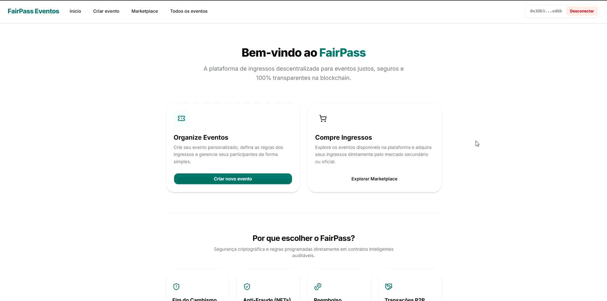

# FairPass



## Sobre o desafio

Projeto desenvolvido para o desafio **TrustCode** do Hackathon Web3 RESTIC 29.

O FairPass é um marketplace descentralizado de ingressos NFT que automatiza venda primária, revenda com escrow e sistema anti-cambismo, e reembolso em cancelamento de eventos — reduzindo abusos, dependência de intermediários, validações manuais e confiança informal.

## Objetivo

Demonstrar como smart contracts podem automatizar acordos, pagamentos e regras de negócio no mercado de ingressos:

- cada ingresso é um **NFT ERC721** com direito de acesso e reembolso;
- a **compra primária** limita 1 ticket por carteira (anti-scalping);
- o **marketplace** custodia o NFT em escrow e repassa pagamento automaticamente;
- o **marketplace** bloqueia listagens de ingressos por valores acima do seu valor base;
- em **cancelamento**, apenas o dono atual do NFT recebe reembolso on-chain.

## Exemplos de aplicação

- Marketplace descentralizado
- Escrow de ativos digitais
- Pagamentos automáticos
- Regras de negócio programáveis (limite de compra, teto de revenda, taxa de plataforma)

## Tecnologias usadas

- Solidity
- Hardhat 3
- Sepolia
- OpenZeppelin
- viem
- wagmi
- React
- Vite
- Tailwind CSS
- Shadcn

## Estrutura

```
/contracts          Smart contracts (Event, Factory, Marketplace)
/frontend           dApp React + wagmi
/test               Testes de integração dos contratos Hardhat + viem
/docs               LITEPAPER.md e vídeos (pitch e fluxo) (documentação estendida)
```

### Contratos

| Contrato               | Responsabilidade                                                                   |
| ---------------------- | -----------------------------------------------------------------------------------|
| `FairPassEvent`        | Emissão de ingressos NFT, status do evento, reembolso e saque                      |
| `FairPassEventFactory` | Criação de novos eventos e taxa de plataforma (1%)                                 |
| `FairPassMarketplace`  | Revenda com escrow, sistema anti-cambismopagamento automático ao vendedor          |

### Participantes do fluxo

- **Organizador** — cria, cancela ou conclui o evento; saca fundos
- **Comprador** — compra ingresso na venda primária
- **Vendedor** — lista o NFT no marketplace
- **Novo comprador** — compra o ticket em revenda
- **Marketplace** — custódia do NFT durante a listagem

## Como executar localmente

### Instalar dependências

Na raiz do projeto:

```bash
npm install
```

### Rodar nó local

Ainda na raiz do projeto:

```bash
npx hardhat node
```

### Fazer deploy dos contratos localmente

Crie um novo terminal e use o ignition:

```bash
npx hardhat ignition deploy ./ignition/modules/FairPassModule.ts --network localhost
```

### Instalar dependências do frontend

```bash
cd frontend
npm install
```

### Configurar ambiente

Crie um .env e:

```bash
VITE_FACTORY_CONTRACT_ADDRESS= 0xe7f1725E7734CE288F8367e1Bb143E90bb3F0512
VITE_MARKETPLACE_CONTRACT_ADDRESS= 0x5FbDB2315678afecb367f032d93F642f64180aa3
```
### Gera a abi usando a cli do wagmi

```bash
npx wagmi generate
```

### Rode o servidor de desenvolvimento do front end

```bash
npm run dev
```

### Acesse no seu navegador

```bash
localhost:5173
```


--------------

## Rodar testes

```bash
npx hardhat test
```

Os testes cobrem criação de evento, compra de ingresso, bloqueio de transferência P2P, listagem e compra no marketplace, cancelamento, reembolso após revenda e saque com taxa de plataforma.


### Endereços de deploy

| Rede      | Marketplace                                  | Factory                                      |
| --------- | -------------------------------------------- | -------------------------------------------- |
| Localhost | `0x5FbDB2315678afecb367f032d93F642f64180aa3` | `0xe7f1725E7734CE288F8367e1Bb143E90bb3F0512` |
| Sepolia   | `0x424079a25Fa3716cd7663e36A7f044701fa3eDA7` | `0x3CF868fd48b33E4be092498Ca0ACF93B32A243A5` |

### Demonstração do fluxo

1. Conectar carteira (MetaMask) no frontend
2. Criar um evento
3. Comprar ingresso com a conta A
4. Listar o ingresso no marketplace
5. Trocar para a conta B e comprar o ticket listado
6. Organizador cancela o evento
7. Conta B solicita reembolso — NFT queimado e ETH devolvido

## Requisitos mínimos

- [x] Contrato deployado
- [x] Fluxo demonstrável
- [x] README funcional
- [x] Vídeo-pitch

## Equipe

Kelvin William de Brito Santos

## Links

Pitch: https://www.youtube.com/watch?v=iADRBtsdWos
Demo-fluxo: https://youtu.be/qVKFpRQTcWk

## Aviso sobre o uso de IA

Este projeto foi desenvolvido utilizando a prática de _pair programming_ (programação em par) com ferramentas de Inteligência Artificial (incluindo Google Gemini, OpenAI ChatGPT, xAI Grok e Anthropic Claude). Essas ferramentas foram utilizadas como parceiras de desenvolvimento para:

- Sessões de _pair programming_ e co-criação de código;
- Brainstorming de ideias, arquitetura e lógica;
- Refatoração, otimização e resolução de problemas.

Todo o código sugerido pela IA foi ativamente revisado, testado e adaptado para garantir a qualidade, segurança e adequação aos requisitos do projeto.
